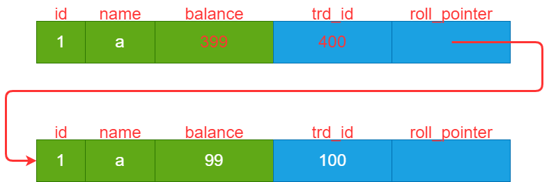

## 事务定义
事务（Transaction）：将多条 DML 语句作为一个整体执行称为事务。对于集合中的 DML 语句，数据库要么全部执行成功，要么全部失败，不允许部分成功的情况。

- DML(Data Manipulation Language, 数据操作语言): 对数据的修改操作，update/insert/delete

## 事务的 ACID 特性
Atomicity(原子性)：原子性代表事务中的操作，要么全部执行成功，要么全部都不执行。
Consistency(一致性): 指数据库必须从一个正确的状态迁移到另一个正确的状态。
Isolation(隔离性): 并发执行多个事务时，各个事务之间互不干扰。
Durability(隔离性): 事务执行完后，数据不会丢失。

## 多事务并发问题

创建表如下：
```
CREATE TABLE t_test_balance (
 id INT,
 name VARCHAR(100),
 balance bigint,
 PRIMARY KEY (id)
) Engine=InnoDB CHARSET=utf8;
```
插入一行初始数据如下：
|  id | name | balance | 
|  ----  | ----  | ---- |
| 1  | iker | 100 |
| 2  | alice | 50 |


### 脏写
脏写: 指的是修改了另一个事务中尚未提交的数据，一旦另一个事务回滚就会有问题。
场景如下，假设事务A扣30元; 事务B增加40元。

|  执行顺序 | 事务A | 事务B| 
|  ----  | ----  | ---- |
| 1  | BEGIN | |
| 2  | | BEGIN |
| 3  | | select Fbalance t_test_balance where id=1 (得到 100)|
| 4  | | update t_test_balance set Fbalance = 140 where id=1 |
| 5  | select Fbalance t_test_balance where id=1 (得到 140) | |
| 6  | update t_test_balance set Fbalance = 110 where id=1 | |
| 7  | COMMIT | |
| 8  | | ROLLBACK |

当事务 B 进行 ROLLBACK 时，数据库恢复到 B 执行前的状态，Fbalance 字段恢复为 100. 然而对于事务 A 来说，其认为事务已经提交了，已经扣除 30 元了，但这个过程被抵消了。
也就是说，事务 B 的回滚，导致了事务 A 的修改无效。


### 脏读
所谓脏读：即读到了另一个事务中尚未提交的数据，一旦另一个事务回滚就会有问题。
场景如下:
- iker 需要查询当前的余额，开启一个事务A 执行;
- 与此同时，iker 又充值了 40 元到账户中，现需要从 iker 的余额增加 40，开启另外一个事务 B 执行。

|  执行顺序 | 事务A | 事务B| 
|  ----  | ----  | ---- |
| 1  | BEGIN | |
| 2  | | BEGIN |
| 3  |  | update t_test_balance set Fbalance = 140 where Fid=1 |
| 4  | select Fbalance from t_test_balance where Fid=1 | |
| 5  | COMMIT | |
| 6  | | ROLLBACK |


### 不可重复读
不可重复读：即在一个事务中对同一条数据多次读取的值不一致，因为其他事务修改的值对此事务是可见的，导致每次能会读取到最新的值。

|  执行顺序 | 事务A | 事务B| 
|  ----  | ----  | ---- |
| 1  | BEGIN | |
| 2  | select Fbalance from t_test_balance where Fid=1 (Fbalance=100)| |
| 3  |  | BEGIN |
| 4  |  | update t_test_balance set Fbalance = 140 where Fid=1 |
| 5  |  | COMMIT |
| 6  | select Fbalance from t_test_balance where Fid=1 (Fbalance=140)| |
| 7  | COMMIT | |


### 幻读
幻读：在事务中先根据某些条件查询记录，之后其他事务又插入一些符合该条件的记录，导致再次读取时候读到了之前没读到的记录。

## 事务的隔离级别

针对以上事务的并发问题，SQL标准制定了四个事务隔离级别：

|  隔离级别 | 脏读 | 不可重复读 | 幻读 | 
|  ----  | ----  | ---- | ---- |
|  READ UNCOMMITED (未提交读)| Y | Y | Y| 
|  READ COMMITED (已提交读)| N | Y | Y | 
|  REPEATABLE READ (可重复读) | N | N | Y | 
|  SERIALIZABLE (串行化)| N | N | N | 

(Y -- 会发生， N -- 不会发生)

从上到下，性能越来越低，但隔离性越来越强。而越强的隔离性，就越不容易出现数据一致问题，尤其是在串行化隔离级别下，每个事务依次排队执行，就不存在任何事务并发产生的问题了。

当然，实际业务中，是不太可能采用串行化这种隔离级别的，因为他的性能实在太低了。

## MySQL 如何解决事务并发问题
### 加锁解决
锁是解决并发最简单的办法。


### MVCC 多版本并发控制
锁虽然解决并发很容易，但毫无疑问也影响了性能。可以看到，在使用锁的时候，读始终读取的是最新的数据版本，并且在此事务提交前，其他事务都不能对该行数据进行写入操作。
不过某些场景下，可能并不需要读取最新的数据。例如需要查询用户余额，并不需要一直阻塞等到其他所有事务提交完再读取最新数据，读取一行历史的数据也是可以的。

MVCC 就是为此准备的，它为我们提供了数据的历史版本。InnoDB 引擎会为每条聚簇索引增加两列：
- trx_id: 改动此条记录的最新事务id
- roll_point: 指向此记录改动前的版本

假设有三个事务 ID 分别为 100，200，300

|  执行顺序 | 事务 100 | 事务 200 | 
|  ----  | ----  | ---- |
| 1 |  BEGIN; <br> INSERT into t_test_balance values(3, 'a', 99); <br> COMMIT;  | |
| 2 |  |  BEGIN; |
| 3 |  | UPDATE t_test_balance set Fbalance = 299 where id=3 | 
| 4 |  | UPDATE t_test_balance set Fbalance = 399 where id=3 | 
| 5 |  | COMMIT | 

那么生成的版本链如下:


既然有这么多历史版本，如何判断应该读取哪一个版本呢？当然，在不同隔离级别下应该读取的版本是不同的。
比如说
在 RC 隔离级别下比较简单，只需要需要解决脏读的问题，也就是说，只要事务提交过后就能读取到。

在 RR 级别下，为了解决不可重复读的问题，必需保证每次读取的数据是一致的，即你每次读取的是该行数据同一个版本。

为了判断当前应该读取哪个数据版本，InnoDB 又提出了 ReadView 的概念，ReadView 主要包含以下四个关键信息：
- `m_ids`：生成此 ReadView 时，系统中正活跃的事务id列表。活跃的意思是创建后，还没提交（或者回滚）的事务。
- `min_trx_id`: 生成此 ReadView 时，系统当前最小的活跃事务 id，即 `m_ids` 里的最小值。
- `max_trx_id`: 生成此 ReadView 时，系统应该分配给下一个事务的 id。

注意这个值不一定是 `m_ids` 的最大值。比如可能生成 ReadView 时，有三个事务（其中 1 和 2 还未提交，3以及提交了），那么 `m_ids` 为[1, 2], `max_trx_id` 为 4, `min_trx_id` 为 1

ReadView 里面的字段，其实都是为了帮助判断数据的哪个版本才是可见的。分别从 RC 和 RR 两个隔离级别分析如何使用 ReadView.

#### RC 隔离级别的 ReadView
前面说过，RC 级别下，事务对数据的修改提交了，就可见了。也就是说，每次读的时候，要去读这行数据所有已经提交版本中最新的那一行。

换句话说，就是每次 SELECT 都需要从版本链里面依次往下找，直到找到一行 **已提交** 的数据，这就是最新的版本。

而如果遍历完版本链还没找到，说明此条数据对该事务是不可见的，返回查询不到数据即可。

具体怎么找呢，就是通过 ReadView 来实现，RC 隔离级别在每次读取的时候（注意这里不是带锁读），都会生成一个 ReadView。因此在 RC 隔离级别下，可以把 SELECT 分为两个阶段完成：
```
1. 创建一个 ReadView
2. 根据此 ReadView 去读取对应的数据
```

根据 ReadView，就可以判断这一行数据是否可见

首先：
```
if trx_id in readview.m_ids {
  return 不可见
} else if trx_id < readview.min_trx_id {
  return 可见
} else if trx_id >= readview.max_trx_id {
  return 不可见
} else if (m_ids[i-1] < trx_id < max_trx_id) {
  // 说明这个事务正好提交了, 数据是可读的
  return 可见
}
```
- `m_ids` 代表生成 ReadView 时当前系统活跃的事务 ID，也就是说这里面的事务全是没有提交的事务。如果 `trx_id` 在这个集合里，说明创建 ReadView 的时候，这个事务还没有提交，因此 Select 也不能读取这一行。

- 小于 `min_trx_id`, 说明修改这行的事务在创建 ReadView 之前就已经提交了，那么这行是可读的。
- 大于等于 `max_trx_id`, 说明修改这行的事务，是在创建此 ReadView 之后才开始的。那么他的修改是不可见

- 大于 `m_ids` 最大值，但又小于 `max_trx_id`。说明此事务是在创建 ReadView 之后，但是 Select 之前提交的，那么也是可见的。

总之，按照这个规则依次遍历版本链，直到找到可见的数据返回即可，如果没找到，说明此行数据对该事务都是不可见的，返回查询不到。

假设当前某条记录如下：


然后开启两个事务 id=300, id=400 操作这行记录:
|  执行顺序 | 事务 300 | 事务 400 | 
|  ----  | ----  | ---- |
| 1 |  BEGIN; | |
| 2 |  |  BEGIN; |
| 3 | SELECT * from t_test_balance where id=3 (得到 Fbalance=99) | | 
| 4 |  | UPDATE t_test_balance set Fbalance = 399 where id=3 | 
| 5 | SELECT * from t_test_balance where id=3 (得到 Fbalance=99) | | 
| 6 |  | COMMIT | 
| 7 | SELECT * from t_test_balance where id=3 (得到 Fbalance=399) | | 

##### 第一次 `SELECT`

此时版本链如下：


然后生成一个 READVIEW:
- `m_ids`: 当前活跃的事务有 300 和 400. 因此为 [300, 400]
- `max_trx_id`: 401
- `min_trx_id`: 300


然后根据上面的规则，尝试遍历版本链：
1. 首先是第一条记录，其 `trx_id` = 100, 小于 `min_trx_id` 内，说明此事务早已提交了，因此可见, 返回即可（得到记录 Fbalance=99）。


##### 第二次 `SELECT`
注意事务 400 此时刚修改了这条记录，但还没有提交，此时版本链如图:


然后此时生成一个 READVIEW 如下：
- `m_ids`: 当前活跃的事务有 300 和 400. 因此为 [300, 400]
- `max_trx_id`: 401
- `min_trx_id`: 300

然后根据上面的规则，尝试遍历版本链：
1. 首先是第一条记录，其 `trx_id` = 400, 位于 `m_ids` 内，说明此事务还是活跃的，因此不可见
2. 然后转到下一条记录，其 `trx_id` = 100, 小于 `min_trx_id`, 可见，因此返回，得到记录（Fbalance=99）.


##### 第三次 `SELECT`
此时版本链还是不变：


但是注意这时候事务 400 已经提交了，同样重新生成一个 READVIEW：
- `m_ids`: 当前活跃的事务有 300. 因此为 [300]
- `max_trx_id`: 401
- `min_trx_id`: 300

遍历如下：
1. 首先是第一条记录，其 `trx_id` = 400, 命中 `m_ids[i-1] < trx_id < max_trx_id` 这条规则，因此可见，直接返回这条记录（得到记录 Fbanlance=399）。


#### RR 隔离级别的 ReadView
RR 隔离级别实现了更强的隔离性，它阻止了不可重复读的发生。而不可重复读的问题，是在事务中第二次及以后 SELECT 时才触发的问题，对于第一次 SELECT 来说其实是没什么影响的。
因此，在 RR 隔离级别下，第一次 SELECT 的时候，采用跟 RC 级别同样的处理方法即可:
```
1. 创建一个 ReadView
2. 根据此 ReadView 去读取对应的数据
```

问题出在第二次及后续的 SELECT 的时候的处理方式，此时显然就不能再次生成 ReadView 了，因为如果重新生成了 ReadView 之后，读取的时候就会读到在第一次 SELECT 之后其他事物提交的修改。(其实就是变成了 RC 级别)。

所以后续的 SELECT 时，应该复用最开始生成的那个 ReadView，使用这个 ReadView 去遍历版本链。但是复用这个 ReadView 是怎么解决了不可重复读的呢？
还是看这个判断规则：
```
if trx_id in readview.m_ids {
  return 不可见
} else if trx_id < readview.min_trx_id {
  return 可见
} else if trx_id >= readview.max_trx_id {
  return 不可见
} else if (m_ids[i-1] < trx_id < max_trx_id) {
  // 说明这个事务正好提交了, 数据是可读的
  return 可见
}
``` 
当第二次（或者后续每一次）去 SELECT 的时候，ReadView 不变的，但是版本链可能改变，因为其他事务可能提交了修改，导致版本链变化。
并且，这些提交的事务，要么是位于 `ReadView.m_ids` 里面，要么是大于等于 `ReadView.max_trx_id` 因为只有处于这两个范围内的事务才可能发生提交，其他范围内的事务都属于已经提交过的事务了。
然后处于这两个范围的事务，他们的修改本来在第一次 `SELECT` 时就是不可见的。所以就算他们提交了不会造成任何影响。因此会忽略这些事务提交的记录，一直从版本链往下找记录，而找到的第一条可见的记录，它是跟第一次 `SELECT` 是一样的。


同样的例子，进行 RR 隔离级别下的推演过程。假设当前某条记录如下：


然后开启两个事务 id=300, id=400 操作这行记录:
|  执行顺序 | 事务 300 | 事务 400 | 
|  ----  | ----  | ---- |
| 1 |  BEGIN | |
| 2 |  |  BEGIN; |
| 3 | SELECT * from t_test_balance where id=3 (得到 Fbalance=99) | | 
| 4 |  | UPDATE t_test_balance set Fbalance = 399 where id=3 | 
| 5 | SELECT * from t_test_balance where id=3 (得到 Fbalance=99) | | 
| 6 |  | COMMIT | 
| 7 | SELECT * from t_test_balance where id=3 (得到 Fbalance=399) | | 


##### 第一次 `SELECT`
此时版本链如下：


RR 级别下只会在第一次 SELECT 记录的时候生成一个 READVIEW:
- `m_ids`: 当前活跃的事务有 300 和 400. 因此为 [300, 400]
- `max_trx_id`: 401
- `min_trx_id`: 300

第一条记录，其 `trx_id` = 100, 小于 `min_trx_id` 内，说明此事务早已提交了，因此可见, 返回即可（得到记录 Fbalance=99）。可见这个过程跟 RC 隔离级别下是一模一样的。

##### 第二次 `SELECT`
注意事务 400 此时刚修改了这条记录，但还没有提交，此时版本链如图:


这里就跟 RC 隔离级别不同了，此时不会重新生成 READVIEW，而是复用之前生成的：
- `m_ids`: [300, 400]
- `max_trx_id`: 401
- `min_trx_id`: 300


然后根据上面的规则，尝试遍历版本链：
1. 首先是第一条记录，其 `trx_id` = 400, 位于 `m_ids` 内，说明此事务还是活跃的，因此不可见
2. 然后转到下一条记录，其 `trx_id` = 100, 小于 `min_trx_id`, 可见，因此返回，得到记录（Fbalance=99）.


##### 第三次 `SELECT`
此时版本链还是不变：


但是注意这时候事务 400 已经提交了, 同样复用之前的 READVIEW:
- `m_ids`: [300, 400]
- `max_trx_id`: 401
- `min_trx_id`: 300

遍历如下：
1. 首先是第一条记录，其 `trx_id` = 400, 位于 `m_ids` 内，不可见
2. 然后到第二条记录，其 `trx_id` = 100, 小于 `min_trx_id`, 可见，因此返回，得到记录（Fbalance=99）.

可见，尽管事务 400 已经提交了，但对于当前事务（id=300）来说，读取的始终是同样的记录值，其他事务的提交并不影响。
