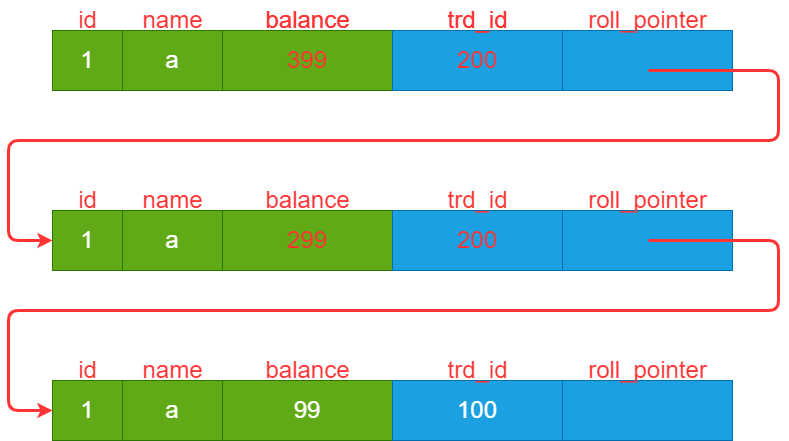

## 事务定义
事务（Transaction）：将多条 DML 语句作为一个整体执行称为事务。对于集合中的 DML 语句，数据库要么全部执行成功，要么全部失败，不允许部分成功的情况。

- DML(Data Manipulation Language, 数据操作语言): 对数据的修改操作，update/insert/delete

## 事务的 ACID 特性
Atomicity(原子性)：原子性代表事务中的操作，要么全部执行成功，要么全部都不执行。
Consistency(一致性): 指数据库必须从一个正确的状态迁移到另一个正确的状态。
Isolation(隔离性): 并发执行多个事务时，各个事务之间互不干扰。
Durability(隔离性): 事务执行完后，数据不会丢失。

## 多事务并发问题

创建表如下：
```
CREATE TABLE t_test_balance (
 id INT,
 name VARCHAR(100),
 balance bigint,
 PRIMARY KEY (id)
) Engine=InnoDB CHARSET=utf8;
```
插入一行初始数据如下：
|  id | name | balance | 
|  ----  | ----  | ---- |
| 1  | iker | 100 |
| 2  | alice | 50 |


### 脏写
脏写: 指的是修改了另一个事务中尚未提交的数据，一旦另一个事务回滚就会有问题。
场景如下，假设事务A扣30元; 事务B增加40元。

|  执行顺序 | 事务A | 事务B| 
|  ----  | ----  | ---- |
| 1  | BEGIN | |
| 2  | | BEGIN |
| 3  | | select Fbalance t_test_balance where id=1 (得到 100)|
| 4  | | update t_test_balance set Fbalance = 140 where id=1 |
| 5  | select Fbalance t_test_balance where id=1 (得到 140) | |
| 6  | update t_test_balance set Fbalance = 110 where id=1 | |
| 7  | COMMIT | |
| 8  | | ROLLBACK |

当事务 B 进行 ROLLBACK 时，数据库恢复到 B 执行前的状态，Fbalance 字段恢复为 100. 然而对于事务 A 来说，其认为事务已经提交了，已经扣除 30 元了，但这个过程被抵消了。
也就是说，事务 B 的回滚，导致了事务 A 的修改无效。


### 脏读
所谓脏读：即读到了另一个事务中尚未提交的数据，一旦另一个事务回滚就会有问题。
场景如下:
- iker 需要查询当前的余额，开启一个事务A 执行;
- 与此同时，iker 又充值了 40 元到账户中，现需要从 iker 的余额增加 40，开启另外一个事务 B 执行。

|  执行顺序 | 事务A | 事务B| 
|  ----  | ----  | ---- |
| 1  | BEGIN | |
| 2  | | BEGIN |
| 3  |  | update t_test_balance set Fbalance = 140 where Fid=1 |
| 4  | select Fbalance from t_test_balance where Fid=1 | |
| 5  | COMMIT | |
| 6  | | ROLLBACK |


### 不可重复读
不可重复读：即在一个事务中对同一条数据多次读取的值不一致，因为其他事务修改的值对此事务是可见的，导致每次能会读取到最新的值。

|  执行顺序 | 事务A | 事务B| 
|  ----  | ----  | ---- |
| 1  | BEGIN | |
| 2  | select Fbalance from t_test_balance where Fid=1 (Fbalance=100)| |
| 3  |  | BEGIN |
| 4  |  | update t_test_balance set Fbalance = 140 where Fid=1 |
| 5  |  | COMMIT |
| 6  | select Fbalance from t_test_balance where Fid=1 (Fbalance=140)| |
| 7  | COMMIT | |


### 幻读
幻读：在事务中先根据某些条件查询记录，之后其他事务又插入一些符合该条件的记录，导致再次读取时候读到了之前没读到的记录。

## 事务的隔离级别

针对以上事务的并发问题，SQL标准制定了四个事务隔离级别：

|  隔离级别 | 脏读 | 不可重复读 | 幻读 | 
|  ----  | ----  | ---- | ---- |
|  READ UNCOMMITED (未提交读)| Y | Y | Y| 
|  READ COMMITED (已提交读)| N | Y | Y | 
|  REPEATABLE READ (可重复读) | N | N | Y | 
|  SERIALIZABLE (串行化)| N | N | N | 

(Y -- 会发生， N -- 不会发生)

从上到下，性能越来越低，但隔离性越来越强。而越强的隔离性，就越不容易出现数据问题，尤其是在串行化隔离级别下，每个事务依次排队执行，就不存在事务并发产生的问题了。

当然，实际业务中，是不太可能采用串行化这种隔离级别的，因为他的性能实在太低了。

## MySQL 如何解决事务并发问题
### 加锁解决
锁是解决并发最简单的办法。


### MVCC 多版本并发控制
锁虽然解决并发很容易，但毫无疑问也影响了性能。可以看到，在使用锁的时候，读始终读取的是最新的数据版本，并且在此事务提交前，其他事务都不能对该行数据进行写入操作。
不过某些场景下，可能并不需要读取最新的数据。例如需要查询用户余额，并不需要一直阻塞等到其他所有事务提交完再读取最新数据，读取一行历史的数据也是可以的。

MVCC 就是为此准备的，它为我们提供了数据的历史版本。InnoDB 引擎会为每条聚簇索引增加两列：
- trx_id: 改动此条记录的最新事务id
- roll_point: 指向此记录改动前的版本

假设有三个事务 ID 分别为 100，200，300

|  执行顺序 | 事务 100 | 事务 200 | 
|  ----  | ----  | ---- |
| 1 |  BEGIN; <br> INSERT into t_test_balance values(3, 'a', 99); <br> COMMIT;  | |
| 2 |  |  BEGIN; |
| 3 |  | UPDATE t_test_balance set Fbalance = 299 where id=3 | 
| 4 |  | UPDATE t_test_balance set Fbalance = 399 where id=3 | 
| 5 |  | COMMIT | 

那么生成的版本链如下:



既然有这么多历史版本，如何判断应该读取哪一个版本呢？当然，在不同隔离级别下应该读取的版本是不同的。
比如说
在 RC 隔离级别下比较简单，只需要需要解决脏读的问题，也就是说，只要事务提交过后就能读取到。

在 RR 级别下，为了解决不可重复读的问题，必需保证每次读取的数据是一致的，即你每次读取的是该行数据同一个版本。

为了判断当前应该读取哪个数据版本，InnoDB 又提出了 ReadView 的概念，ReadView 主要包含以下四个关键信息：
- creator_trx_id: 生成此 ReadView 的事务 id。
- m_ids：生成此 ReadView 时，系统中正活跃的事务id列表。活跃的意思是创建后，还没提交（或者回滚）的事务。
- min_trx_id: 生成此 ReadView 时，系统当前最小的活跃事务id，即 m_ids 最小值。
- max_trx_id: 生成此 ReadView 时，系统应该分配给下一个事务的 id。

注意这个值不一定是 m_ids 的最大值。比如可能生成 ReadView 时，有三个事务（其中 1 和 2 还未提交，3以及提交了），那么 m_ids 为[1, 2], max_trx_id 为 4, min_trx_id 为 1

ReadView 里面的字段，其实都是为了帮助判断数据的哪个版本才是可见的。分别从 RC 和 RR 两个隔离级别分析如何使用 ReadView.

#### RC 级别的 ReadView
前面说过，RC 级别下，事务对数据的修改提交了，就可见了。也就是说，每次读的时候，要去读这行数据所有已经提交版本中最新的那一行。

换句话说，就是每次读都需要从版本链里面依次往下找，直到找到一行已提交的数据，这就是最新的版本。

而如果遍历完版本链还没找到，说明此条数据对该事务是不可见的，返回查询不到数据即可。

具体怎么找呢，就是通过 ReadView 来实现，RC 隔离级别在每次读取的时候（注意这里不是带锁读），都会生成一个 ReadView。


